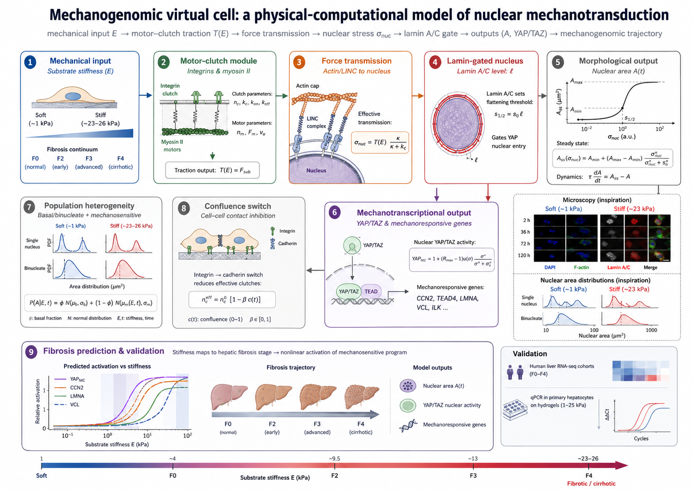

<h1>
  
  Mechanogenomic virtual-cell model
</h1>

[](https://www.python.org/)
[](https://numpy.org/)
[](https://scipy.org/)

A minimal, first-principles physical model of nuclear mechanotransduction that
links substrate stiffness to nuclear deformation, YAP/TAZ activity, and
fibrosis-associated transcriptional trajectories. Calibrated against nuclear
area of primary hepatocytes on hydrogels and validated against human liver
RNA-seq cohorts across fibrosis stages.

📖 **Full documentation:** see the [project Wiki](../../wiki).

## Quick start

```bash
pip install -r requirements.txt
python src/mvirtual_cell.py       # model self-test / demo
python tests/test_virtual_cell.py # validation suite (11 checks)
python results/make_nature_figures.py   # regenerate the figures
```

```python
import sys; sys.path.insert(0, "src")     # or: pip install -e .
from mvirtual_cell import (PHENOTYPES, nuclear_stress, nuclear_area_ss,
                          yap_nc_ratio, nuclear_area_time, population_mixture,
                          fibrosis_prediction, CALIBRATION)

hep = PHENOTYPES["hepatocyte"]          # calibrated phenotype

nuclear_stress(23.0, hep)               # nuclear mechanical drive at 23 kPa
nuclear_area_ss(23.0, hep)              # steady-state nuclear area
yap_nc_ratio(23.0, hep)                 # YAP nucleocytoplasmic ratio
nuclear_area_time(23.0, t=36, ph=hep, contact_inhibition=True)  # area at 36 h
population_mixture(23.0, t=36, ph=hep)  # (mu_low, mu_mecano, phi)
fibrosis_prediction(hep)                # F0->F4 prediction
```

## Repository structure

```
mechanogenomic-virtual-cell/
├── README.md · requirements.txt · CITATION.cff · Theory_draft.md
├── assets/                      study diagram and logos
├── src/                         the model and its layers
│   ├── paths.py                 centralized data/results path resolution
│   ├── mvirtual_cell.py         physical model + calibrated parameters
│   ├── fast_model.py            fast analytic surrogate (~10⁵× speed-up)
│   ├── calibration.py           fitting layer (recover params from data)
│   ├── recalibration.py         two-level recalibration on the 2-120 h timecourse
│   ├── inference.py             simulation-based inference (ABC-SMC + timecourse)
│   ├── symbolic.py              symbolic regression (discover σ(E) form)
│   └── pharmacology.py          clinical mapping · drugs · toxicity (hypotheses)
├── data/                        input data
│   ├── hepatocyte_complete_data.json     complete 2-120 h timecourse (1 & 23 kPa)
│   ├── hepatocyte_two_populations.csv    two-population deconvolution
│   ├── saturating_params.json            fitted σ(E) = Vmax·E/(K+E) params
│   └── Datasets.md                       RNA-seq cohort descriptions
├── results/                     outputs
│   ├── hepatocyte_posterior.json         ABC timecourse posterior
│   ├── make_nature_figures.py            figure generation script
│   └── figures/                          Fig1-3 + recalibration (pdf + png)
└── tests/
    └── test_virtual_cell.py     11 validations (runs in CI)
```

Modules import each other by name; data and result paths are resolved through
`src/paths.py`, so scripts work from any working directory. Scripts outside
`src/` (tests, figure generation) add `src/` to the path automatically.

> **Note on σ.** `nuclear_stress` returns a *nuclear mechanical drive*
> (transmitted nuclear load) — a monotone scalar with force units, not a stress
> in Pa. The name is kept for continuity; read it as "nuclear drive".

## Model structure (`mvirtual_cell.py`)

1. **Motor-clutch engine** (`_mc_kernel`) — stochastic kernel, numba-accelerated.
2. **Phenotype** (dataclass) + **PHENOTYPES** — calibrated library (hepatocyte, A549, NHLF, MCF10A, MDA, AT2, fibroblast).
3. **Mechanotransduction chain** — `traction` → `nuclear_stress` → `nuclear_area_ss`, `yap_nc_ratio`, `lamin_expected`.
4. **Temporal dynamics + contact inhibition** — `nuclear_area_time`, `nc_effective`, `confluence`.
5. **Two-population model** — `population_mixture`, `BASAL_POP` (binucleate + mechanosensitive).
6. **Fibrosis → stiffness → prediction** — `FIBROSIS_STIFFNESS`, `fibrosis_prediction`.
7. **CALIBRATION** — summary of all values fitted to the data.

## Calibrating from your own data (`calibration.py`)

The fitting layer recovers the model parameters from experimental data, so the
calibration is reproducible rather than hard-coded.

```python
import calibration as cal

data = cal.load_hydrogel_csv("areas.csv")            # {(E, t): areas}

# two-population deconvolution (GMM + BIC): basal vs mechanosensitive
rows = cal.two_population_table(data)
print(cal.population_stats(rows))

# fit a full phenotype (lamin A/C, A_min, A_max, tau) from the data
phenotype, report = cal.fit_phenotype(data, name="my_hepatocyte")

# validate model prediction against RNA-seq (fibrosis)
corr = cal.correlate_with_expression(["F0","F1","F2","F3","F4"],
                                      gene_expression, predictor="sigma")
```

Key functions: `deconvolve_two_populations`, `fit_lamin_from_area`,
`fit_temporal`, `fit_phenotype`, `correlate_with_expression`.

## Bayesian inference (`inference.py`)

Infers the **posterior** over physical parameters (with uncertainty and
identifiability), not a point fit. The stochastic motor is expensive, so a
fast emulator is built once and ABC-SMC runs on it.

```python
import inference as inf
# static (area vs stiffness) inference over nc, laminAC:
res = inf.abc_smc(observed_area, Es)
# timecourse inference over laminAC, A_max, A0 (uses complete 2-120 h dynamics):
res_t = inf.abc_timecourse(observed_dynamics)   # {(E, t): area}
```

Two inference paths. The **timecourse** version uses the complete 2-120 h
dynamics (recalibrated data) and is the current best estimate: it gives lamin
A/C ≈ **2.0** (95% CI ~1.7–2.4), together with a **strong** mechanical response
(area ~2.2× from 1→23 kPa). This *supersedes* the earlier lamin ≈ 1.66 estimate,
which came from 36 h-truncated data and wrongly implied a weak response.

Honest limits: only two stiffnesses (1 & 23 kPa) have complete timecourses, so
laminAC, the motor coupling α, and A_max/A0 are partially confounded; the fit
(R² ≈ 0.76) shows a systematic bias because the saturating motor stress does not
generate enough 1-vs-23 kPa contrast to match the observed 2.2× ratio.
**Report the directly-measured 2.2× fold-change as the primary result** and
treat the laminAC posterior as an effective estimate. Fully resolving α needs
the intermediate stiffnesses (0.5, 5 kPa) at steady state (120 h). See
`hepatocyte_posterior.json`.

## Discovering the functional form (`symbolic.py`)

Symbolic regression (genetic programming) on data generated by the **stochastic
motor** shows that the stiffness→drive map is a saturating (Michaelis-Menten)
form, `σ(E) = Vmax·E/(K+E)`, which beats power-law, log, and linear baselines.

## Fast analytic surrogate (`fast_model.py`)

Uses the discovered saturating form for an instant, closed-form `nuclear_stress`
(~10⁵× faster than the stochastic motor, R² ≈ 0.97–0.997 per phenotype). The
stochastic engine in `mvirtual_cell.py` remains the ground truth; this is the
fast approximation for sweeps, sensitivity, and inference. Parameters are loaded
from `saturating_params.json` (the reproducible source of truth).

```python
import fast_model as fm
fm.nuclear_stress_fast(23.0, "hepatocyte")   # instant
fm.calibrate(PHENOTYPES["MCF10A"])           # refit Vmax, K for any phenotype
```

## Application: clinical, drug, toxicity (`pharmacology.py`)

A hypothesis-generating layer, **not** a validated pharmacology/toxicity
predictor (no drug metabolism, PK, off-targets, or DILI). Three connections,
each grounded in the physics with explicit limits:

- **Clinical** — liver elastography (kPa) is the model's input; `map_patient`
  places a patient on the mechanogenomic trajectory.
- **Drugs** — mechanotransduction-targeting drugs map to physical parameters
  (contractility, clutches, tissue stiffness, YAP output). Three axes are
  distinguished: *mechanical* (resolved directly), *growth-factor/signaling*
  (nintedanib, pirfenidone, nerandomilast — net stiffness only), and
  *metabolic* (resmetirom, lanifibranor — furthest upstream, benefit not
  predictable from mechanics).
- **Toxicity** — hepatocyte function as a function of the nuclear mechanical
  drive σ (albumin/urea/CYP450/HNF4a fall as σ rises). Mechanical-function
  axis only.

```python
import pharmacology as ph
ph.map_patient(13.0)                 # F3 patient -> trajectory
ph.screen_drugs(E=26.0)              # rank drugs at cirrhotic stiffness
ph.toxicity_flag("fasudil", E=26.0) # mechanical-function change
```

## Validation (`test_virtual_cell.py`)

Runnable checks that the calibrated model reproduces its qualitative anchors:

```bash
python test_virtual_cell.py      # or: pytest test_virtual_cell.py -v
```

Covers: biphasic traction, stiffness-dependent nuclear spreading, YAP
activation, lamin-knockdown collapse of YAP, phenotype lamin ordering,
two-population dynamics, contact inhibition, temporal relaxation, monotonic
fibrosis response, and clutch-vs-motor sensitivity of the optimum.

## Calibrated parameters (primary hepatocyte)

Recalibrated on the **complete timecourse** (2/36/72/120 h at 1 & 23 kPa;
earlier work used data truncated at 36 h, which underestimated the dynamics).

- **Motor-clutch:** nm=45, Fm=2.0, vu=110, nc=90, kon=0.5, koff0=0.1, Fb=2.0, kc=1.1, α=0.13.
- **Two populations:** low pop ~38 µm² (mononucleate + binucleate mix, weakly
  stiffness-responsive) + mechanosensitive pop (mononucleate, grows strongly).
- **Stiffness-dependent dynamics:** relaxation τ **scales with stiffness** —
  ~16 h (soft, 1 kPa) to ~79 h (stiff, 23 kPa). The old fixed τ=35 h was an
  artifact of 36 h truncation. See `tau_of_E()` and `recalibration.py`.
- **Strong mechanical response:** nuclear area ~2.2× from 1→23 kPa
  (A_ss ≈ 100 → 253 µm² for the mechanosensitive population), stable over time.
- **Saturating form (motor):** σ(E) = 65·E/(5.01+E), R² = 0.98.
- **Fibrosis stages:** F0 ~1–4, F1 ~7, F2 ~9.5, F3 ~13, F4 ~26 kPa.

> **Data limitation.** The complete timecourse exists only for 1 and 23 kPa.
> The 0.5 and 5 kPa conditions were measured at 36 h only, which is far below τ
> at high stiffness, so their steady-state area is not directly measured. The
> area-vs-stiffness *shape* between anchors is therefore interpolated.

## Recalibration (`recalibration.py`)

Two-level fit on the complete timecourse: τ(E) and the mechanical fold-change
from the full 1 & 23 kPa curves (level 1), and the area-vs-stiffness shape from
the 36 h data (level 2, flagged as transient — the 36 h curve is non-monotonic
because slow-relaxing stiff substrates have not yet equilibrated).

```python
import recalibration as rc
rc.tau_vs_stiffness()        # tau per population at 1 and 23 kPa
rc.mechanical_fold_change()  # 23/1 kPa response over time (~2.2x)
rc.recalibrated_summary()    # full recalibrated parameter summary
```

## Notes

- Runs without numba, but ~50-100x slower; install it for parameter sweeps.
- Simulations are stochastic: use a larger `reps` (6-8) for stable means.
- Hepatocyte parameters are calibrated against real data; the other cell lines
  use literature-anchored starting points (laminAC is inferred from area and
  validated against qPCR).

## Diagram



## Citation

If you use this model or repository, please cite it via the
[`CITATION.cff`](CITATION.cff) file (GitHub's "Cite this repository" button).
